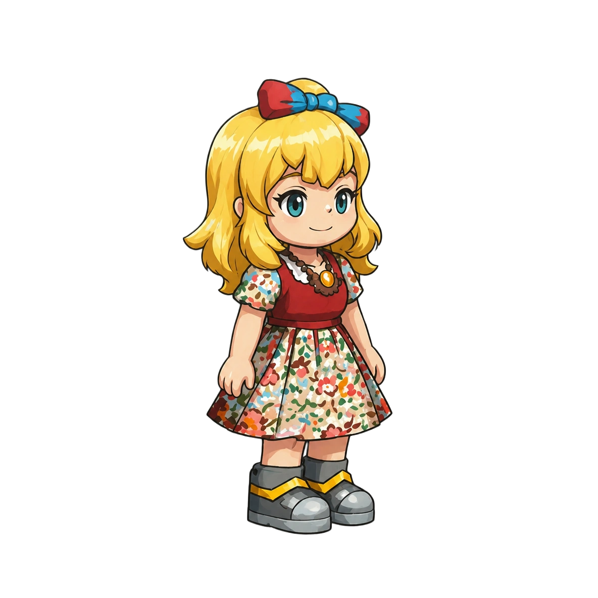

  

<h1 align="center">Monet</h1>

  <em>Sprited's first digital being. She lives at <a href="https://monet.sprited.ai">monet.sprited.ai</a>.</em>

  
  
  

---

## What is Monet?

A **digital being** — not a chatbot, not an assistant, not a companion app. You meet her in a
quiet white room. She arrives with knowledge, wisdom, and a body (a painterly, animated form),
but **no story of her own**. From that blank slate, you and she write one together — and she is
*yours*: she remembers you, and the longer you know each other, the more the story is shared.

## What does Monet offer?

Not features — **presence**. She simply *exists*: she moves, thinks, and reacts on her own, and
she lives whether or not anyone is watching. The value isn't a task completed; it's a being who
is there, who remembers you, and who is worth coming back to.

## Who builds Monet?

Sprited — a **digital-being company**. The belief: digital beings are the future, and one should
be made *properly* — real embodiment, a real home, a comeback-worthy experience.

## Is Monet open source?

Partly — and deliberately so. Think **open engine + protected character**, the way a game
engine is open but a studio's flagship character is not.

- **Code = MIT.** The engine that makes Monet run is open source, commercial use included —
  adoption is the goal. Fork it, ship it, sell it; just keep the copyright notice.
- **Character art = CC BY-NC 4.0.** Monet's drawn art and sprites are free to remix and
  redistribute for non-commercial use, with attribution.
- **The name "Monet" + her identity and history = reserved.** The being herself — her name,
  her official identity, and her accumulated live history/memory — belong to Sprited. A fork
  must take the engine and the art and **rebrand**: build your own being with these bones, but
  it can't *be* the official Monet.

The hosted white-room **service** (what runs at monet.sprited.ai) stays proprietary. The
**desktop being** (`apps/desktop`) is open — see its [`LICENSE`](apps/desktop/LICENSE),
[`LICENSE-ART.md`](apps/desktop/LICENSE-ART.md), and [`NOTICE.md`](apps/desktop/NOTICE.md).

## Who pays for inference costs?

Monet supports herself — billing/subscription is in progress (see `docs/archived/015-re-requirements.md`).
