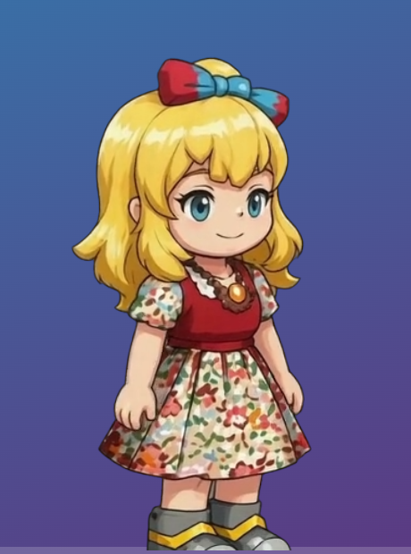

# Monet — a little being who lives on your desktop

**Presence without a key; alive with one.**

Monet is an AI-animated, hand-curated character who lives on top of your screen — a transparent
cutout floating over whatever you're doing, click-through everywhere except where *she*
actually is. Out of the box she's *present*: idling, breathing, grounded in the corner.
Hand her your own Anthropic API key and the brain lights up — she reads what's on your
screen (locally) and talks back.

No account. Her body is served from `monet.sprited.ai`; everything that's *yours* — your
key, your messages, your screen text — never touches our servers. It's open source, so you
can check that line for yourself.



> *Above: the render running in overlay mode at the real overlay window size (460×620). The
> desktop gradient and the faint "dock" strip are fakes injected behind the page to prove the
> canvas is genuinely transparent — only Monet has pixels, her feet grounded on the bottom
> edge. In the app, the shell makes that transparency a real window over your real desktop.*

---

## What she does

- **She's a cutout on your desktop (껌딱지).** Frameless, transparent, always-on-top.
  Click-through everywhere except her silhouette, so she sits on top of everything without
  stealing a single click from the work underneath. Drag her anywhere; dock her to a corner.
  *껌딱지* — the thing that stays stuck to you.

- **She wakes up with your key (BYOK).** Without a key she's just present — the render runs,
  she idles and breathes. Paste an Anthropic API key and the brain comes online: she reacts to
  what you say and to what's on your screen. The key lives only in the app's main process and
  is sent to `api.anthropic.com` and nowhere else.

- **She reads your screen — locally, on demand.** Two paths, both on-device:
  **Accessibility** (default — reads the text apps already expose to assistive tech, *no pixels
  captured*, exact strings) and **OCR** (opt-in fallback via Apple Vision, for canvas/game apps
  that expose no text; the frame is deleted the instant text is extracted). Only the extracted
  *text* ever moves, and it goes straight into the prompt to your own key.

- **She's AI-animated, hand-curated.** 20+ painterly states — idle, greet, sit, doze, react —
  generated, then matted to clean transparency. Driven by emotion tags her brain emits, so what she
  says and how she looks line up.

> **Honest scope:** today she's *present and reactive* — she responds when you talk to her and
> can see your screen when asked. The *autonomous* loop — her acting on her own, wandering,
> reacting to focus changes and notifications without you — is on the roadmap, not in this build.
> We're not going to call her "alive" before she earns it.

---

## Privacy

The whole reason this is BYOK and open source:

- **Screen reading is on-device.** Accessibility reads text without ever capturing pixels. The
  OCR fallback runs Apple Vision locally and deletes the frame immediately. Nothing is uploaded.
- **Your key → the model, full stop.** It's stored locally on your Mac (macOS Keychain via
  Electron `safeStorage`), held only in the main process, and sent only to `api.anthropic.com`.
  The hosted page never sees it.
- **Nothing of yours hits our servers.** We serve her *body* (static render assets). Your
  conversation and your screen text bypass us entirely and go straight to Anthropic with your key.
- **Auditable.** It's all here. The seam that reroutes chat to your key is a few lines of
  `preload.js` / `main.js` — read it, don't trust us.

---

## Make her yours

What ships here is a **desktop-being engine**: the transparent click-through shell, the
on-device screen-read, the BYOK brain loop. Monet is the *reference being* riding on top of it —
the worked example, not the whole point.

The point is that *you* can give your own character a home on someone's desktop with the same
parts. Today that means forking this and swapping the render and persona by hand — a clean,
turnkey character-swap is **roadmap, not a button yet**. We'd rather say that plainly than ship a
"customize" screen that doesn't exist.

---

## How she's built

The sprite pipeline — the part the r/aigamedev thread kept asking about. It's not magic, and the
one non-obvious trick is the matte color.

1. **Animated states** — each clip (idle, greet, doze…) is a short video generated with
   **Seedance 1 pro**.
2. **Character / fills** — the base character and still poses use **flux1 pro fill** (Flux.1 Pro
   Fill) for inpainting.
3. **Cutout** — background removal with **BiRefNet + Toonout**, run through an **RMBG node** to get
   a clean alpha matte per frame.
4. **The trick: matte on gray or green, never white.** A white background bleeds into the
   character's light edges and the matte can't tell them apart — you get halos and chewed-up
   outlines. A neutral **gray** or **green** field separates cleanly and the alpha comes out crisp.
5. **Delivery** — the color/alpha/normal/depth layers are stacked into a single video and decoded
   with **WebCodecs** (one decoder, frame-exact), then composited so only her pixels survive onto
   the transparent canvas.

That's the whole flow. Nothing hidden.

---

## Quick start

Requires **macOS** and **Node 18+**. Xcode command-line tools (`swiftc`) are optional — without
them the screen-read helpers just don't compile and that feature stays off; everything else works.

```bash
git clone <this repo>
cd monet
npm install     # hoists Electron + compiles the Swift screen-read helpers (skipped if no swiftc)
npm run dev     # (or npm start) — one command: boots her body locally + the desktop shell
```

Monet appears docked in a corner, floating over everything. **Local-first:** `npm run dev` runs her
whole body on *your* machine (a local render server + the shell) — nothing of ours is in the loop.
The hosted body at `monet.sprited.ai` is only a 2nd-class fallback (see `MONET_URL` below).

Then give her a brain:

1. Get an Anthropic API key at **console.anthropic.com** (it bills your own usage).
2. Menu bar **🎨 Monet → Set API key…**, paste your `sk-ant-…` key.
3. She wakes up. Default model is `claude-haiku-4-5`; override with `MONET_MODEL`.

Controls:

- **Click her** → she starts listening; click again to stop.
- **Drag her** → move her around (a click stays a click; only motion past ~4px drags).
- **Right-click her** → menu: read screen (test), reload, hide, quit.
- **Quit** any of: right-click → Quit Monet, the 🎨 Monet menubar item, or **⌘⇧Q**.

---

## License

- **Code** — **MIT**. Fork it, ship it, build your own being on it.
- **Monet's character art** — **CC-BY-NC 4.0**. Use her, remix her, spread her; credit Sprited;
  commercial character use stays ours.
- **The name "Monet", her official identity, and her live history** — reserved by Sprited. Forks
  must rebrand; you can't *be* the official Monet. (That part was never copyable anyway.)

See [`LICENSE`](./LICENSE) for the code terms.

---

## Development

The shell is a thin Electron wrapper over the existing whiteroom app's `/desktop` route (overlay
mode). The web-app change is **purely additive** — at `/` (without the `overlay` prop) the white
room is byte-for-byte unchanged.

### Architecture

A browser tab can't make a transparent, always-on-top, click-through window over your desktop —
only a native shell can. Two pieces:

| Layer | Where | What it does |
|---|---|---|
| **Overlay mode** | `apps/web/` (the app) | Gated on the `/desktop` route (the `overlay` prop). The WebGL context becomes alpha-backed, clears to `(0,0,0,0)`, and only the character node draws (room backdrop, contact shadow, vignette/grain post are skipped so they don't tint see-through pixels). UI chrome hides. Clicking her canvas toggles listening (`toggleHandsFree`). Exposes `window.__monetAlphaAt(x,y)` so the shell can read her silhouette, and `window.__monetReadScreen()` for screen text. |
| **Native shell** | this dir (Electron) | Frameless + `transparent` + `alwaysOnTop('screen-saver')` + visible on all Spaces. Loads `…/desktop`. Click-through by default (`setIgnoreMouseEvents(true, { forward: true })`); the preload reads `__monetAlphaAt` under the cursor each move and flips the window interactive only while the cursor is over her pixels. |

See `apps/web/src/scene/Renderer.ts` (the `opts.overlay` branch + `alphaAt`) and `apps/web/src/Whiteroom.tsx`
(the `overlay` branch).

**Why Electron for the PoC (Tauri later):** the app leans on WebCodecs (the stacked
color/alpha/normal/depth decode). Electron bundles Chromium, so the render behaves *identically*
to the live app — zero render risk. The eventual ship vehicle is **Tauri** (~10 MB vs ~150 MB,
code-signable, lower idle cost). Because all overlay logic lives in the web app + a thin preload,
swapping the shell later is cheap.

### Pointing at a local render

`npm start` loads the render from `MONET_URL`. For app development, point it at your local dev
server (run the web dev server — `npm run dev -w @monet/web` serves React + the Cloudflare worker
API on `:1874`):

```bash
# terminal 1 — her body (from the repo root)
npm run dev -w @monet/web
# terminal 2 — the shell against local
MONET_URL='http://localhost:1874/desktop' npm start   # run in apps/desktop
```

### Env knobs

| Var | Default | Meaning |
|---|---|---|
| `MONET_URL` | `http://localhost:1874/desktop` | Render source — her body, served **locally** (`npm run dev` starts it). 2nd-class fallback: set it to the hosted body `https://monet.sprited.ai/desktop` to run the shell without a local server |
| `MONET_MODEL` | `claude-haiku-4-5` | Anthropic model for the BYOK brain |
| `MONET_W` / `MONET_H` | `460` / `620` | Her window footprint |
| `MONET_CORNER` | `br` | `br` \| `bl` \| `tr` \| `tl` |
| `MONET_DEVTOOLS` | — | `1` opens detached devtools |

### Screen read internals

Two on-device paths, both exposed as `window.__monetReadScreen()` → `{ ok, via, text }`:

- **Accessibility (default, no pixels):** `monet-axread` reads the frontmost window's exact text
  via the macOS Accessibility API. Needs the **Accessibility** permission (System Settings →
  Privacy & Security → Accessibility), granted to Electron. Caveat: AX only sees what apps
  *expose* — web/native UIs are rich; canvas/Electron/game apps may expose little.
- **OCR (opt-in fallback):** `screencapture` → temp PNG → `monet-ocr` (Apple Vision) → text →
  PNG deleted immediately. Covers anything *rendered*. Needs **Screen Recording** permission, so
  it never fires on its own. Vision runs offline; `automaticallyDetectsLanguage` reads mixed
  Korean + English correctly while keeping code casing (verified).

Both helpers are small Swift programs (`ax/monet-axread.swift`, `ocr/monet-ocr.swift`), compiled
by `postinstall` (or `npm run build:native`). No `swiftc` → screen-read disables; the rest works.
Test from the right-click menu — a notification shows the first ~240 chars; full text logs to the
console.

### Status

**Working (verified):**
- Overlay render — transparent canvas, clean silhouette, no edge halo. Alpha probe: body/head =
  `1.0`, all corners = `0.0`.
- Framing — a small overlay-only lift (`Renderer.overlayLiftPx`, 4 CSS px) un-clips her soles so
  her feet sit *on* the bottom edge (grounded, not floating).
- `__monetAlphaAt` silhouette hit-test driving click-through (contextIsolation off so the preload
  can read it).
- Press semantics: click → `toggleHandsFree`; drag → move; right-click → menu.
- Screen read — both Accessibility and OCR paths, on-device, testable from the menu.
- **BYOK brain** — the preload reroutes the page's `/api/chat` through the user's own key in the
  main process (`monet:byok-chat` IPC → `net.fetch('https://api.anthropic.com/v1/messages')`). Key
  stored in macOS Keychain via `safeStorage`, held only in the main process, sent only to
  `api.anthropic.com`. The render is hosted; only chat is BYOK. The brain itself (persona + reply
  parse) is a pure, testable module (`byok.js`).

**Next:**
- **Mic in Electron** — the shell grants the page `media`, but real capture still needs the macOS
  mic prompt (unsigned dev builds can be flaky).
- **Full-bleed window** — a work-area-wide click-through window (she can stand anywhere) instead of
  a fixed corner; heavier (full retina canvas), so a follow-up.
- **Ambient idle behaviors / autonomous loop** — wander, peek, react to focus changes and
  notifications on her own. The whiteroom's idle FSM exists; this is the step that earns "alive".
- **Tauri port** — the real ship vehicle (~10 MB, code-signable, lower idle cost).

---

*Made by [Sprited](https://sprited.ai). Monet is our first being. We're building the primitive
layer for digital beings — the way game engines did for graphics.*
