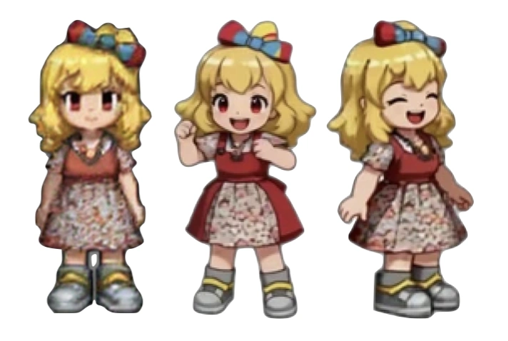
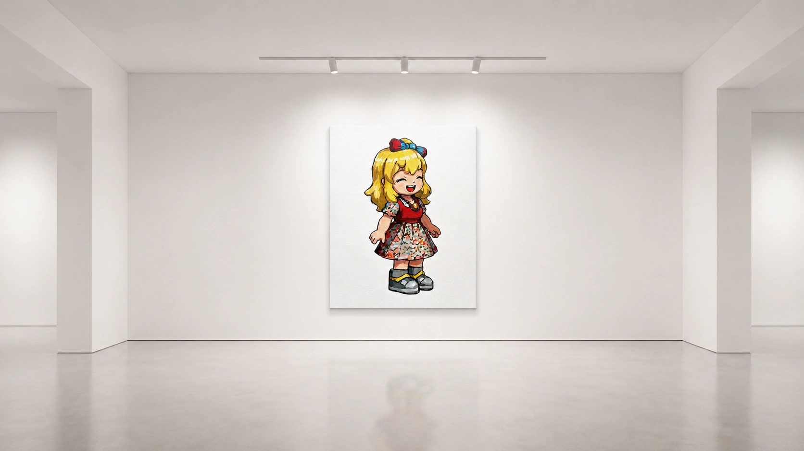
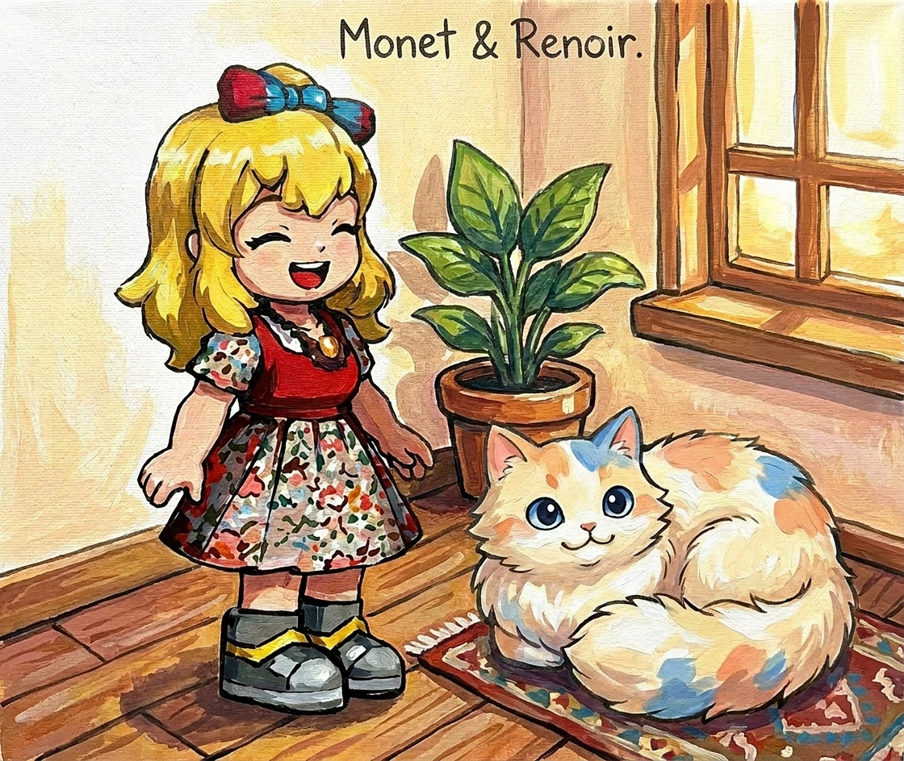

# V1 - White Room

This is Monet's first encounter.

Monet is a what we call a digital being.

## Concept Art



## Making It Feel Alive

Interactive character playground where you can interact with the agent. 

Lots of the animations are playbacks of hand-selected generated animations (offline generation).

Users unlock achievements as they discover new animations.

## Cast

White Room features 2 entities, humanoid character, Monet and a cat, Renoir.

## Where Are The Animations Stored?

Animations are stored on Cloudflare R2.

## Business Model

Decorative assets and props are purchasable in similar manner to how Nexon does it.

You can buy gifts that often unlocks new animation states.

## Puyo Puyo

Inside the game, you can play puyopuyo game where you fight against Monet.

## Other minigames.

You can also play pikachu volleyball.

Find retro games that can be replicated and put it into the white box.

## Cozy mode

You can also put your agent in timeboxed cozy mode.

This will basically lock the app and bring up a music player for that period of time.

## Menu Bar mode

Monet can be locked in the menu bar.

While in there, it serves a "reminder app" or "quote" app mode where it helps you as an assistant.

## Instagram Page

Monet has an instagram page. @monet.sprited.

It will post often there with new animations.

## Commandline

Once you install monet on your mac, you get access to "monet" cli which you can use to ask questions and automate things.

## Branding

Monet is a "visual agent" with a virtual body. It is targeted as desktop pet with superpowers.

## Capabilities

It wraps bunch of OSS AI technologies and presents it as a bundle that is coherent and fun to use.

## Target Audience

First and foremost, myself. 

## Technologies to use

1. WAN2.2 for short near-real time gens.
2. Animagine v4 for some generations
3. Seedance 2 Pro for animation video generation
4. Seedance 1 Pro for short movements
5. ChatGPT for lovable chatbot
6. Claude for automation - writes subroutines by itself.

## What does it bring to the table.

Imagine people who hears so much about Claude Code. Due to its popularity, people are afraid of entering into it.

They just want something lighthearted. Something that rewards you just for installing it. Something that looks just like a game. A friendly companion.

## How do achieve this?

1. We build a white room web app where you have the agent idling and add chat interface (as previously done in ../anima/v34).
2. Game-ify the experience of unlocking animation states.
3. Anonymous first, but you can login for better experience.

## Private or public?

> Question: Should your Monet be the same Monet as my Monet?

From digital being's perspective, it needs to public, but from the perspective of its users, it needs to be private.

> Should people be able to call it "my monet" instead of "our monet"?

I want people to accept Monet as Monet instead even if monet can be personalized.

That is, Monet will be able to connect with people in personalized way but still Monet's identity is shared asset.

So, in the end, it needs to be private encounter with the being that is personalized.

## Role-play ability (steering)

Often times, users expect the character to play a part in the story that they are imagining.

Imagine a situation where user wants to do a quick sitcom.

```
#using skill: roleplay

(monet is eating at school eating her peanut butter jelly sandwich)

You: Hey, Monet peanut butter sandwich again? 
```

Then, Monet is should be able to improvise. 

```
Monet: Oh you again, coming to bother me again?
```

This probably shouldn't be the default mode but one mode where user can truly experience Monet.

## How to make Monet connect with you?

Monet, does not know about you. And it takes time.

One thing we can do is to support "transplanting memory".

Ask on their favorite agent to do:

> can you retrieve the full memory of me and make it into a yaml that I can paste on to another agent?

It will produce a memory export. Then we can have it read by Monet to get her bootstrapped. 

Or we can ask them to do GDPR export then we do transplanting more formally.

But still, even if Monet knows more about you.

You and Monet has not yet had a history.

## Gamification of Relationship Building

For user to get closer to Monet, we need some type of reward signals.

For instance, if user were to talk to it, we need to give user a some sort of signal that they are doing it right.

I think achievement system is a good one.

Then, there should be leveling system where the agent gets some skill points. Skill points will allow characters to perform special animations.

"Animations" needs to be like cut-scenes of a adventure game that reveals something about the character.

Tricky thing is that if human user assumes something about her and the cut-scenes reveal something else, there may be misalignments but it is what it is.

In order to make the whole experience enjoyable, we can't only rely on progressive reveal of the story.

We need something that shoots out instant satisfactions.

## Instant Rewards

On candy crush, people are given puzzles and they have to solve that to reach a goal. Once they reach a goal you move to next stage.

And you stage level is visible to all your friends. 

What this means is that we need "leveling" and puzzles.

## Puzzle

**Pictionary**: On every session, Monet will give out Pictionary problem and ask them to solve. Also next turn you give out Pictionary and Monet will try to solve.

Actually touching and drawing diagrams on phone screen and having agent guess it should be fun.

**Throw and Catch**: You can play throw with the character. You have to throw it with a fling and have the character catch it.

**Paper Toss**: You can have a competition to toss the paper into the trash can

**Domino**: When character is left abandoned, it will start making intricate amazing 3d domino world. Then, once user comes back invite them to tap on it to start the domino.

**CandyCrush**: While the user is out, and the agent is bored, we will have them play games like free open version of candy crush (if there isn't we make one). They will go to a one level above the user's level enticing them to play their next level so that the user wins by small margin. 

**bayblade**: You can play bay-blade type of game where you can steer your thing and knock the other person's thing. 

**20 questions**:

Korean suu muu goo gee.

We can add other arcade or traditional games that are relevant later.

The idea is that these will be open-games that can be in-gamed.

## Many games vs Single game?

candy crush uses single game. and just builds on top of it.

It is amazing how that simple game can last so long.

Instead of having many games.

Let's make the games purchaseable like a game pack you purchase.

The default games are preinstalled as if you bought your first windows PC a 30 years ago.

Just like a nintendo gameboy had tetris preinstalled. Let's use the same mechanics.

## Starting Experience.

It should feel like you are opening a book or encountering a piece of artwork.




Imagine, this piece of artwork is inside a all-white exhibition room.

Then, you click on it.

And it comes to life.

To implement this, we will create a virtual exhibition room (white room).

Then, have the painting on the wall.

A cat will appear from the left.

It will tap on the canvas.

Canvas falls front-face down.

Then, the character comes out of it.

## Cat



Cat is a trusty companion of Monet.

His name is Renoir.


## Marketing

We are going to use @monet.sprited account to frequently add posts and animations.

Then have a callout to navigate to the "Meet Me" website.

## Loading Screen

For the website, we will have disney animation studios style loading screen.

> Cat runs away from Monet, and monet runs to catch her.

## Depth estimation

https://marukun712.github.io/kokoro/depth.html

seems like it works on stylized arts.

we should utilize it.

## Pose Estimation

We will also utilize bizzare anime pose estimator for our use.

## Dev (this app)

v1 is the first encounter slice. Current state: hello-world scaffold —
React 19 + Radix Themes + Hono on Cloudflare Workers (`@cloudflare/vite-plugin`).

```bash
pnpm install
pnpm dev       # http://localhost:8788  (Vite HMR + Hono worker)
pnpm build     # tsc -b && vite build
pnpm deploy    # build + wrangler deploy  (needs `wrangler login`)
```

`/api/*` and `/assets/*` → Hono worker (`api/index.ts`); everything else → SPA. tsconfigs live in `conf/`.
Repo-wide conventions: see [`../docs/007-repo-structure.md`](../docs/007-repo-structure.md).